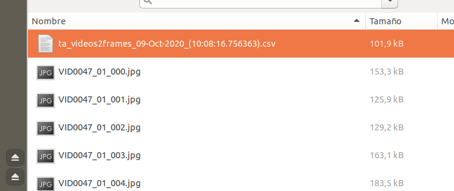
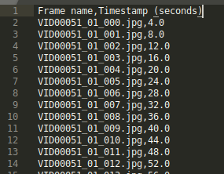

# TAVideo2Frames

Project for sampling frames from a video or a folder containing videos.
It saves the frames with the _video id_ and the number of the sampled frame in the output folder.

### Requirements

* Python 3.6+
* Linux and Windows
* OpenCV 4.1.0+
* Matlibplot

### Script for installation
For the installation of the _requirements_ and _environment_ run the next script:
* Run: `./install.sh`

## Usage
By default, the application read the videos from: `/data/videos`
By default, the sampled frames are saved in: `/data/images/output`

By default, the results are saved in HDF5 format, but they can be saved in CSV as well.

Please, check the input arguments options in the _main_ function.

### Process only one video
`python3 ./tavideo2frames.py -v /path/to/video -of ./output/path -fr "CSV" -sr 0.25`

`-sr` option is the sample rate. It indicates the sampled images per second. 

### Process an entire directory in one go with the default videos
`python3 ./tavideo2frames.py` (Default input and output folders) 

`python3 ./tavideo2frames.py -if /path/to/folder/with/videos -of ./output/path -fr "CSV" -sr 0.25 `

### Save frames with output file with annotations
It saves a file containing the name of the images (frames) saved in the output folder,
and the time stamp in the video.
(By default is _False_)

Set `-sre` option to True.

`python3 ./tavideo2frames.py -if /path/to/folder/with/videos -of ./output/path -fr "CSV" -sr 0.25 -sre True
`

### TODO list
 - [ ] Basic preprocessing operations (rotations, flips, data augmentation)

